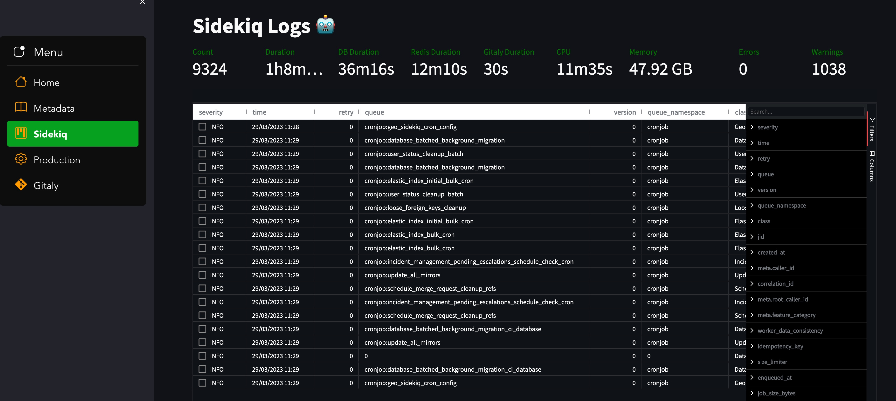

# SOSParser :sos:

**SOSParser** makes dealing with logs collected from GitLabSOS a bit easier. Right now, it works with Production, Sidekiq and Gitaly log files. In addition, it can also provide a quick summary of information collected from various files in the GitLabSOS logs such as `cpuinfo`, `df_hT`, `gitlab_migrations`, `gitlab_status` and so on.


The tool is built using Python streamlit and pandas libraries, SOSParser turns log files into interactive tables where we can easily sort and filter columns. This helps us narrow down logs quickly. Once we filter the logs as per the requirements, we can export them as CSV files, with plans to add JSON export later on.


## Prerequisites

- Python 3.7 or higher
- pip (or pip3)

## Installation

1. Clone the repository:

```bash
git clone git@gitlab.com:gitlab-com/support/toolbox/sosparser.git
cd sosparser
```

2. Install the dependencies using the `requirements.txt` file:

```bash
pip install -r requirements.txt
```

If you have pip3 installed then you can use

```bash
pip3 install -r requirements.txt
```

If you want to use a [virtual environment](https://docs.python.org/3/library/venv.html), run the following commands instead:


```bash
virtualenv venv
source venv/bin/activate
pip3 install -r requirements.txt
```

## Running the Tool

To run the tool, execute the following command:

```bash
streamlit run app.py --browser.gatherUsageStats=false
```

After running the command, a new browser window should open automatically. If it doesn't, you can access the tool by navigating to the following URL in your browser:

```
http://localhost:8501
```

Once the page is ready copy the absolute path of the logs directory and paste it in the text box on the application UI 

Example path for log directory:

```
/Users/azzy/Downloads/gitlabsos.dv-git-_20230329105343
```

Then click on _Submit_ button and the application should validate the files that it is going to process further. If all the files exist, then then the logs can seen in thier respective UIs

## How does this work?

For each type of log, the tool looks for the file in its respective log directory and converts the file contents into a [Pandas Dataframe](https://pandas.pydata.org/docs/reference/api/pandas.DataFrame.html), which is 2D data structure ideal for storing data in rows and columns. 

Once we have the Dataframe ready, we can perform lots of arithmetic and logical operations on the data. For example, the application does all the calculations and produces output of [fast-stats](https://gitlab.com/gitlab-com/support/toolbox/fast-stats) with few lines of code for each log file.

We can also simply output the Dataframe content as a table on a webpage. However, when we combine  this with libraries like [AgGrid](https://www.ag-grid.com/javascript-data-grid/getting-started/) (free version) and [Streamlit](https://streamlit.io/) we can easily render a highly interactive table with features like filtering, sorting, and pagination. 



## Plotting graphs

- The tool provides an interactive graph to plot a table column's values over the time. The X-axis is the time and Y-axis is the value of the column, which can be changed in realtime by selecting a column from the dropdown.
- Each data point on the graph can be clicked to see the log data associated with it. Here's an example:


## Exporting Table Results 

You can export results from dataframes with right-click and select one of the `Export as ...` options. You can also export  
after you have filtered, sorted and modified columns on the output, so that only the selected data is generated in the export file.


## Things to consider

- The tool expects the log files to be available in their default location inside the SOS logs directory. For example, the Sidekiq logs are located at `var/log/gitlab/sidekiq/current`. 
- If a column is missing in the log file, the tool will display that column's values as `0` in the table.
