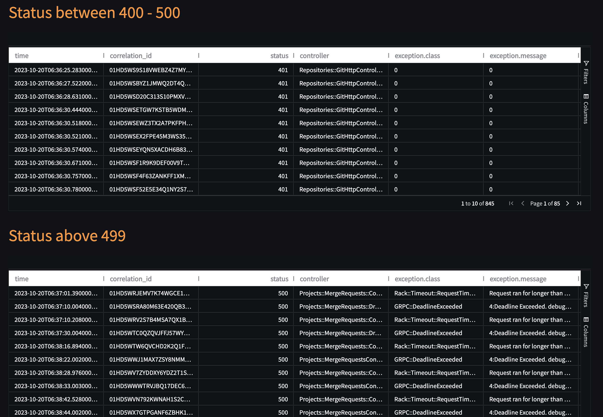

# SOSParser :sos:

**SOSParser** is a lightweight Python tool that parses the [GitLabSOS](https://gitlab.com/gitlab-com/support/toolbox/gitlabsos) logs and provides a graphical user interface to interact with them. 


## Prerequisites

- Python 3.7 to 3.11 (due to https://gitlab.com/gitlab-com/support/toolbox/sosparser/-/issues/17)
- pip (or pip3)

## Installation steps

<details>
<summary>Expand</summary>

1. Clone the repository:

```bash
git clone git@gitlab.com:gitlab-com/support/toolbox/sosparser.git
cd sosparser
```

2. Install the dependencies using the `requirements.txt` file:

```bash
pip install -r requirements.txt
```

 - If you have pip3 installed then you can use

```bash
pip3 install -r requirements.txt
```

 - Or if you want to use a [virtual environment](https://docs.python.org/3/library/venv.html), run the following commands instead:

```bash
virtualenv venv
source venv/bin/activate
pip3 install -r requirements.txt
```
</details>

---

## Steps to start the SOSParser

<details>
<summary>Expand</summary>

1. Add the following function to `~/.bashrc` or `~/.zshrc` file so that the sosparser can be triggered from the command line directly:

 ```
sosparser() {
  local path="${1:-$(pwd)}"
  if [[ -z "$path" ]]; then
    path="$(pwd)"
  fi
  
  if [[ "$OSTYPE" == "darwin"* ]]; then
    /usr/bin/open "http://localhost:8501/?path=$path"
  elif [[ "$OSTYPE" == "linux-gnu"* ]]; then
    xdg-open "http://localhost:8501/?path=$path"
  else
    echo "Unsupported OS"
  fi
}
 ```

2. Navigate to the SOSParser directory and execute the command below. This will launch a new browser tab at http://localhost:8501::

```bash
streamlit run app.py --browser.gatherUsageStats=false
```

3. Once the page loads, copy the absolute path of the logs directory. Then, paste this path into the text box on the application's user interface (webpage), add any optional comments, and click the 'Submit' button.

4. We can also open the logs directly from the logs directory in the command line tool as follows:

- We can provide the absolute path to the sosparser command
```
> sosparser /Users/azzy/Downloads/gitlabsos.dv-git-_20230329105343 
```

- Or we can just execute sosparser in the log directory (this will take the pwd value as input by default)
    
```
> sosparser 
```

5. Logs uploaded through the UI can be optionally saved within the application for easy future reference and analysis.

</details>

---

## Metada from the log files

<details>
<summary>Expand</summary>

- GitLabSOS contains many files that hold valuable information. This tool extracts some metadata from each file and displays the information on the UI:


</details>

## Working with tables

<details>
<summary>Expand</summary>

Here are the following things we can do with the tables to extract the data:

- **Filter the columns** : By default, the table includes numerous columns that may not be necessary for our purposes. However, we can customize which columns we wish to view by clicking on the _Filter_ button located on the right side of the table.


    
- **Sort columns** : Click on the column name to sort the data numerically or alphabetically.


    
- **Filter Rows** : We can filter the table rows based on specific values. For instance, it's possible to display only the rows that correspond to a particular project name, user, or correlation ID. In fact, we can apply multiple filters to refine the rows further, such as viewing user logs for project XYZ.

| Global row filter            | Column row filter              |
| ---------------------- | ---------------------- |
|  |  |


- **Autosize the column width** : By clicking on the three dots next to the column name in the table, you can select 'Auto size all columns' to automatically adjust and set the width of each column to fit the content of the column headers.

 

</details>

---

## Fast-stat results 

<details>
<summary>Expand</summary>

- The individual log pages (Gitaly, Production) by defaults shows the fast-stat resutls on the UI.


- On the same page we can find the top 10 results (projects, users etc.) with respect to the selected metric (Duration, Memory, CPU etc.). This is equalent to the `fast-stat top` command.


</details>

---

## Top 10 results

<details>
<summary>Expand</summary>

- Similar to fast-stat we can extract the top ten values (like project, user etc) based on the resource usage.
- For example, the following screenshot shows top 10 paths against duration in api_json.log file
- 

- Similarly, the following example shows which projects took the highest db duration in Sidekiq log file
- 

</details>

---

## Errors & warnings

<details>
<summary>Expand</summary>

- By default, the tool parses errors and warnings based on the known factor like status codes, sevirity etc. These errors are shown in separate tables.

- 
- 
 
</details>

---

## How it work?

<details>
<summary>Expand</summary>

- Other than the metadata, the tool converts the log file contents (GitLab, Production, API, etc.) into a Pandas DataFrame. We can perform a variety of arithmetic and logical operations on these DataFrames. For example, the application can generate the results of fast-stats, which is really helpful when troubleshooting an issue.

- In this tool, we also use the AgGrid (free version) tables and Streamlit libraries to provide a front end with dynamic tables that are searchable, sortable, paginated, and filterable in the UI.


</details>


## Plotting graphs

- The tool provides an interactive graph to plot a table column's values over the time. The X-axis is the time and Y-axis is the value of the column, which can be changed in realtime by selecting a column from the dropdown.
- Each data point on the graph can be clicked to see the log data associated with it. Here's an example:


## Exporting Table Results 

You can export results from dataframes with right-click and select one of the `Export as ...` options. You can also export  
after you have filtered, sorted and modified columns on the output, so that only the selected data is generated in the export file.


## Things to consider

- The tool expects the log files to be available in their default location inside the SOS logs directory. For example, the Sidekiq logs are located at `var/log/gitlab/sidekiq/current`. 
- If a column is missing in the log file, the tool will display that column's values as `0` in the table.
